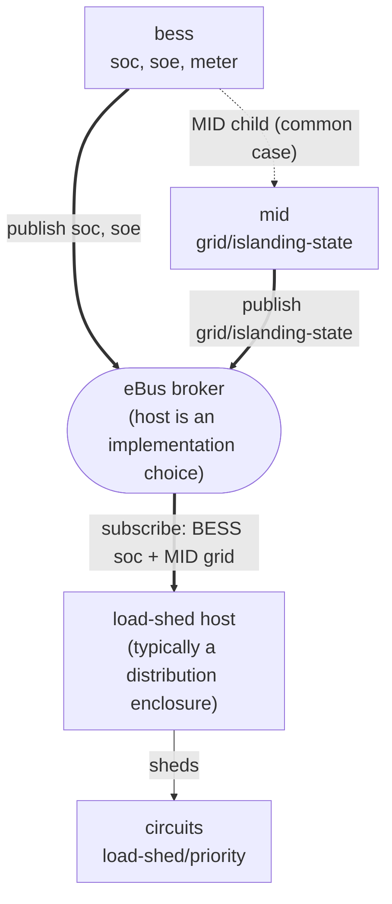

# BESS ↔ Distribution Enclosure Integration Guide

**Type:** Integration Guide (informative)
**Status:** DRAFT
**Version:** 0.1
**Date:** 2026-07-27
**Authors:** Don Jackson

## Overview

This integration guide is **informative**. It describes how two [Electrification Bus](https://ebus.energy) (eBus for short) data models, the [BESS](../data-models/bess.md) and the [distribution enclosure](../data-models/distribution-enclosure.md), compose at runtime when both are present on the same eBus broker, so that a distribution enclosure can manage backup power correctly: shedding loads when the home islands, and pacing that shedding against the battery's remaining energy. The normative property contracts remain in the individual data-model documents; this guide composes them.

The mechanism described here is vendor-neutral. Two logically distinct devices publish the state the enclosure consumes: a Microgrid Interconnect Device (MID) publishes the grid-connection (islanding) state, and a BESS publishes its state of charge. Most products today combine the two (the MID ships as part of the BESS system, published as its child), but they remain separate eBus devices. A distribution enclosure subscribed to both drives its own load-shedding policy from them; no device writes to another. The two surfaces involved (`grid` on the MID, `soc` on the BESS) make no vendor-specific assumptions; any conformant publishers and any conformant enclosure subscriber can participate.

Two interaction points carry almost all of the coordination, and this guide is organized around them: the **grid-connection (islanding) state** the enclosure needs in order to know it is running on battery, and the **state of charge / state of energy** the enclosure needs in order to decide how long backup can last and when to shed the next tier of load. Both flow from the BESS to the enclosure; both directly determine the enclosure's load-shedding behavior.

**Three participants: the BESS, the MID, and the load-shed host.** Although this guide is titled for the two device classes that pair most visibly, the coordination is really three-way, and the Microgrid Interconnect Device (MID) is a first-class participant: it publishes the `grid/islanding-state` that gates the entire load-shedding flow (Interaction 1). Where the MID lives varies and matters a little to the integration. Most commonly it is integral to the BESS, published as the BESS's `{bess-id}-mid` child, so it rides along with the BESS and needs little separate handling; some enclosures instead integrate their own MID (`{enclosure-id}-mid`); and as the MID matures toward its own eBus device type, a standalone MID becomes a more distinct participant. This guide treats the MID as the authoritative source of grid-connection state wherever it lives, and flags its placement only where that changes who publishes what.

**The shed/load-shed host role.** Load-shedding is a host-generic eBus capability pair: [`shed`](../capabilities/shed.md) (the settable policy inputs) on the coordinating host, and per-circuit [`load-shed`](../capabilities/load-shed.md) on each circuit. The spec defines these as published by "a load-coordinating host," which today is typically a distribution enclosure but need not be: any device that coordinates circuits against backup runtime can host them, and a plug-in BESS, for instance, self-publishes its own [`shed-forecast`](../capabilities/shed-forecast.md) per [`bess.md`](../data-models/bess.md). This guide uses the distribution enclosure as the concrete, canonical host throughout, because it is the common one and the one paired in the sibling integration guides; wherever it says "the enclosure," read "the shed/load-shed host" if your integration places that role on a different device.

## Audience and Scope

This guide is for:

- **BESS publishers** (battery OEMs building eBus-native firmware, and integrators building proxies on a BESS's behalf) implementing the `soc` capability and the BESS's MID-child `grid` capability.
- **Distribution-enclosure publishers** (panel vendors) implementing the subscriber side that consumes a BESS's grid-connection state and state of charge and turns them into load-shedding decisions.
- **Integrators and commissioners** wiring a specific BESS and enclosure together at install time.
- **Reviewers** wanting to understand how the two data-model surfaces compose for backup management.

The guide covers:

- The pub / sub flow between a BESS and an enclosure.
- The grid-connection (islanding) interaction: where `grid/islanding-state`, `grid-state`, and `grid-forming-entity` are published and how the enclosure consumes them.
- The energy interaction: how the enclosure consumes the BESS's `soc` / `soe` and aggregates across multiple BESS.
- How the enclosure composes those two inputs into its load-shedding policy (`shed`), its off-grid forecast (`shed-forecast`), and per-circuit shedding (`load-shed`).
- How the enclosure behaves when it loses sight of the BESS (it holds the last-retained state).
- Commissioning, discovery, and authorization at install time.
- Robustness and edge-case handling.

The guide does **not** cover:

- Normative property definitions. Those live in [`data-models/bess.md`](../data-models/bess.md) and [`data-models/distribution-enclosure.md`](../data-models/distribution-enclosure.md).
- **BESS dispatch and control.** How an enclosure or other controller commands the BESS (setpoints, backup reserve, charge / discharge) is the BESS `dispatch` capability's concern and is out of scope here; this guide is about the enclosure *observing* the BESS to manage loads, not *commanding* it.
- **Plug-in BESS / UPS** (device-output islanding via an `output-island` capability and `outlet` children). This guide is scoped to the **premises-wiring grid-forming BESS** (the variant that forms a whole-home microgrid through a MID); see [`bess.md`](../data-models/bess.md) for the plug-in and grid-following-only variants.
- Vendor-specific commissioning UIs, provisioning flows, and internal battery-management details.

**Scope: premises-wiring grid-forming BESS.** The interactions below assume the BESS can form a premises-wiring island, which per [`bess.md`](../data-models/bess.md) means it MUST publish a MID child that carries the `grid` capability. A grid-following-only BESS (no islanding, no MID) still publishes `soc` and `meter` and participates in the energy interaction, but has no grid-connection interaction and does not drive off-grid shedding; those parts of this guide simply do not apply to it.

---

## Architecture

The coordination flows entirely through the broker: the BESS and MID publish their own state, the load-shed host subscribes and acts on it, and no device writes to another.



Two roles on the BESS side, published by one BESS device tree:

- **Grid-state publisher** (the BESS's MID child). A premises-wiring grid-forming BESS publishes a MID child (`energy.ebus.device.mid`) whose `grid` capability carries `islanding-state` (MUST), `grid-state` (SHOULD), and `grid-forming-entity` (SHOULD). This is the authoritative statement of whether the home is on grid or islanded, and, when islanded, which DER is forming the microgrid.
- **Energy publisher** (the BESS device itself). The BESS publishes its `soc` capability (`soc` in percent, `soe` in kWh) and its `meter` (instantaneous battery power, positive = discharging) for the enclosure to consume.

One role on the enclosure side:

- **Backup manager** (the distribution enclosure). The enclosure subscribes to the BESS's MID `grid` and the BESS's `soc`, and independently publishes its own backup-management surface: `shed` (the settable policy inputs), `shed-forecast` (off-grid time-remaining), and the per-circuit `load-shed/priority` outcomes it enforces. The enclosure never writes to the BESS; it acts on its own published state by its own internal logic.

Two devices, one broker. The BESS may be **eBus-native** (its own Homie root device, ID = its bare serial) or **proxied by the enclosure** (a child of the enclosure device, ID = `{enclosure-id}-{bess-serial}`); the interaction described here is identical either way, because it is expressed entirely through the `grid` and `soc` surfaces, which both representations carry. Consumers tell native from proxied by the root device's `$description.type` (see [`proxy.md`](../data-models/proxy.md)). **Which LAN element hosts the broker is an implementation choice** this guide does not constrain: it may be the enclosure, the BESS, a gateway, or any other device on the LAN.

**Whose MID is authoritative.** A premises-wiring grid-forming BESS ships its own MID, published as a child of the BESS (`{bess-id}-mid`); the enclosure does not publish a separate MID in that case (per [`distribution-enclosure.md`](../data-models/distribution-enclosure.md)). The enclosure therefore learns the islanding state by subscribing to the BESS's MID child. Some enclosures instead have an **integrated MID** of their own and know the islanding state first-hand; there the grid-connection interaction below is internal to the enclosure rather than a cross-device subscription. This guide centers on the BESS-provides-the-MID case, which is where the cross-device interaction actually lives.

## Publish / subscribe semantics

### Topics

The BESS publishes its full Homie 5 / eBus device representation. The two surfaces the enclosure consumes land at:

```
ebus/5/<bess-id>/soc/soc                    state of charge, percent
ebus/5/<bess-id>/soc/soe                    state of energy, kWh
ebus/5/<bess-id>-mid/grid/islanding-state   ON_GRID | OFF_GRID | UNKNOWN
ebus/5/<bess-id>-mid/grid/grid-state        UP | DOWN | DEGRADED | UNKNOWN
ebus/5/<bess-id>-mid/grid/grid-forming-entity  "GRID" | <forming DER device id>
```

The enclosure subscribes to the BESS's `soc` node and the MID child's `grid` node. Robust subscriptions are the wildcards `ebus/5/<bess-id>/soc/+` and `ebus/5/<bess-id>-mid/grid/+`, so the subscriber receives every property as it is published, including future additions.

The enclosure independently publishes its own backup-management surface, which downstream consumers (mobile app, dashboard, energy apps) read:

```
ebus/5/<enclosure-id>/shed/policy
ebus/5/<enclosure-id>/shed-forecast/total-time-remaining
ebus/5/<enclosure-id>/shed-forecast/time-to-priority-shed
ebus/5/<circuit-id>/load-shed/priority
ebus/5/<circuit-id>/switch/relay-requester       LOAD_SHED when auto-shed drove the relay
```

### No `/set` semantics on the observed surfaces

`soc` and the MID's `grid` are publish-only from the enclosure's point of view. No `/set` topic on those properties is part of this flow; the enclosure has no mechanism, and no need, to tell the BESS what its charge or islanding state should be. That is a deliberate auth simplification, and each side needs only the minimum permission:

- The **BESS** needs publish permission on its own device topics. It needs no write permission on any enclosure property.
- The **enclosure** needs subscribe permission on the BESS's device topics. It needs no write permission on any BESS property.

The enclosure's own settable `shed/policy` (where the host exposes runtime tuning) is a control input to the *enclosure* (written by a consumer / operator, applied by the enclosure to its own state), not a cross-device write to the BESS. There is no shared mutable surface between the two devices and no cross-device write privilege. Commanding the battery, when a controller needs to, is a separate concern carried by the BESS's own `dispatch/set` topics and is out of scope here.

### Retained values

`soc` and `grid` properties are published as retained MQTT messages (the Homie 5 convention). A subscriber that connects after a value was published receives the most recent value immediately on subscribing, and can re-establish its subscription after a disconnect without missing the current state.

### Update cadence

The two inputs change on very different timescales, and the enclosure treats them differently:

- **`islanding-state` is event-driven and latency-sensitive.** It changes at the moment the home islands or rejoins, which is exactly when the enclosure must act. The BESS's MID publishes it on change; the enclosure reacts promptly.
- **`soc` / `soe` drift continuously but slowly.** The BESS publishes on meaningful change plus optional periodic liveness. The enclosure treats absence of an update as "no change," not "unknown," and paces SOC-driven shedding against the smoothed trend rather than any single sample.

---

## Interaction 1: grid-connection (islanding) state

The enclosure's load-shedding is fundamentally gated on one question: **is the home running on the grid, or on the battery?** For a premises-wiring grid-forming BESS, the authoritative answer is the BESS's MID child `grid/islanding-state`.

| Property (on the BESS's MID child) | Meaning to the enclosure |
|---|---|
| `islanding-state = ON_GRID` | Utility is connected and carrying the home. No off-grid shedding; the enclosure's off-grid limits and OFF_GRID-priority shedding are inactive. |
| `islanding-state = OFF_GRID` | The home is islanded on the battery-formed microgrid. The enclosure activates off-grid load management: OFF_GRID-priority circuits shed immediately, SOC-tiered shedding arms, and `shed-forecast` becomes the live countdown. |
| `islanding-state = UNKNOWN` | The MID cannot state its relay position. The enclosure falls back conservatively (see Robustness and edge cases) rather than assuming on-grid. |
| `grid-state = UP / DOWN / DEGRADED` | The sensed condition of the utility. `DEGRADED` in particular lets the enclosure anticipate an imminent transition; it is advisory, not the relay position. |
| `grid-forming-entity = "GRID"` or a DER device id | While grid-tied, `"GRID"`. While islanded, the device ID of the DER forming the microgrid (the BESS parent). Lets a consumer attribute the island to the entity holding it up. |

**The enclosure does not decide islanding; it observes it.** The MID owns the relay and the islanding decision. The enclosure's job is to subscribe, react, and reflect the consequence onto its own circuits. The `grid-forming-entity` handoff (from `"GRID"` to the BESS's device ID at the moment of islanding, and back on reconnect) is the BESS telling the system who is holding the microgrid up; the enclosure does not need to write anything for that handoff to occur.

When the enclosure has its **own integrated MID** instead of consuming the BESS's, the same three properties are published on `{enclosure-id}-mid/grid` and the enclosure reads them first-hand. The downstream shedding logic below is identical; only the source of `islanding-state` differs.

## Interaction 2: BESS state of charge and state of energy

Islanding tells the enclosure *that* it is on battery; the BESS's `soc` capability tells it *how much runway remains*, which paces the shedding.

| Property (on the BESS) | Meaning to the enclosure |
|---|---|
| `soc/soc` (percent) | Aggregate state of charge is the trigger for **SOC-tier shedding**: circuits marked `load-shed/priority = SOC_THRESHOLD` shed once aggregate SOC falls below the policy's `soc-threshold-shed` (and restore above `soc-threshold-release`). |
| `soc/soe` (kWh) | State of energy, together with the current backed-up load draw, is the basis for the enclosure's **`shed-forecast`** (`total-time-remaining`, `time-to-priority-shed`). |

**Aggregation across multiple BESS.** A home may have more than one commissioned BESS. The enclosure computes a single aggregate view for its policy: an energy-weighted state of charge for the SOC-threshold trigger, and summed available energy for the forecast. The exact aggregation method is an enclosure-implementation detail (the data model does not prescribe it); what matters to a BESS publisher is that it publishes its own `soc/soc` and `soc/soe` accurately, and the enclosure combines them.

**Liveness is the BESS's Homie `$state`.** A native BESS publishes directly to the broker, so the enclosure detects it going away from the device tree's Homie `$state`: an ungraceful disconnect fires the Last Will and sets `$state = lost` (inherited by the whole child tree, including the MID), and the enclosure then falls back to the last-retained `soc` and `islanding-state`. This broker-level liveness is distinct from the BESS's own `status/communication-state`, which is the publisher's self-report of its internal battery communication.

---

## Composing the two inputs: load-shedding

The enclosure turns islanding-state and aggregate SOC into circuit-level action through three of its own capabilities. This is the BESS↔enclosure analog of the utility-meter guide's import-limit composition: two published inputs combine, by the enclosure's policy, into one enforced outcome.

**Per-circuit shed class (`load-shed/priority`).** Each circuit declares how it participates:

- `OFF_GRID`: shed as soon as the home islands (`islanding-state = OFF_GRID`), regardless of SOC. Non-essential loads a homeowner does not want drawing down the battery at all.
- `SOC_THRESHOLD`: shed once aggregate BESS SOC falls below the policy's `soc-threshold-shed`, and restore once it rises back above `soc-threshold-release` (a deadband that prevents relay chatter). Loads worth backing up for a while, but not worth draining the battery to empty.
- `NEVER`: never auto-shed. Critical loads (medical, life-safety).
- `UNKNOWN`: unclassified.

**Enclosure shed policy (`shed`).** The enclosure publishes a self-describing `shed/policy` document; the reference algorithm is `soc-priority.v1`, whose parameters are a two-sided SOC hysteresis (for example `{"algorithm":"soc-priority.v1","parameters":{"soc-threshold-shed":49,"soc-threshold-release":51}}`). The policy binds the per-circuit classes to the two BESS inputs: islanding gates the `OFF_GRID` tier, and the SOC thresholds (compared against aggregate SOC) gate the `SOC_THRESHOLD` tier. When auto-shed logic drives a circuit's relay, that circuit publishes `switch/relay-requester = LOAD_SHED`, so a consumer can attribute the open relay to shedding rather than to a manual or PCS action.

**Off-grid forecast (`shed-forecast`).** From aggregate `soe` and the current backed-up draw, the enclosure publishes `total-time-remaining` (how long backup lasts at the current rate) and `time-to-priority-shed` (how long until aggregate SOC reaches `soc-threshold-shed` and the next shed tier fires). Full-charge variants project the same from a hypothetical full battery. These are published only while at least one BESS is commissioned.

**When the MID goes away, hold the last-retained `islanding-state`.** The chain depends on the enclosure seeing the MID's `islanding-state`, but because that value is retained, a native MID going offline (its Homie `$state` transitions to `lost` via the Last Will) does not blind the enclosure: it keeps acting on the last-retained `islanding-state` until the MID returns and republishes. (A host that instead reaches the DER through a non-eBus integration, i.e. proxies it, has an additional consumer-assertable recovery path via `shed/asserted-islanding-state`, gated on `connection/feeds-device-status` link health; that is a proxy concern, outside the scope of this native guide.)

The effective shed decision for a circuit is therefore:

```
effective islanding-state = MID grid/islanding-state   (subscribed; retained, so the
                            last-known value stands while the MID's $state is lost)

shed(circuit) = (priority == OFF_GRID       and effective islanding-state == OFF_GRID)
             or (priority == SOC_THRESHOLD   and effective islanding-state == OFF_GRID
                                             and aggregate SOC < policy.soc-threshold-shed)
```

`NEVER` and `UNKNOWN` circuits are never auto-shed. A circuit's relay is opened by shedding only when it is controllable; the enclosure never opens a circuit commissioned as permanently `OFF_GRID`-locked or otherwise non-controllable.

## Power-flows (brief)

Alongside the two state inputs, the enclosure's site-level `power-flows` capability (`grid` / `battery` / `pv` / `site`, in watts) aggregates the BESS's instantaneous contribution with the rest of the site. The raw input from a premises-wiring grid-forming BESS is its `meter/active-power` (positive = discharging, out of the battery, per [`bess.md`](../data-models/bess.md)); the enclosure folds that in with its own and its other children's metering to compute `power-flows/battery` and the site view. (`power-flows` here is an enclosure capability; a centralized BESS supplies the raw power through its `meter`, whereas an all-in-one plug-in BESS MAY instead publish its own `power-flows`, per `bess.md`.) This is a measurement aggregation, not a control interaction, and is independent of the islanding / SOC shedding flow above; it is mentioned only because the same BESS discharge the enclosure folds into `power-flows/battery` is, when off-grid, the backed-up-load draw the `shed-forecast` runs against.

---

## Commissioning

The enclosure needs four things to consume a BESS for backup management:

1. **A network path to the broker.** Both devices must reach the same eBus broker over the LAN. Network-provisioning specifics (Wi-Fi vs. Ethernet, addressing, mDNS discovery) are out of scope here; vendors document them in product-specific material.
2. **Broker credentials for each side.** Both the BESS and the enclosure authenticate to whichever LAN element hosts the broker, using that host's provisioning flow, and obtain MQTT credentials. The host's auth interface is its own concern and is outside this guide's scope.
3. **Knowledge of which BESS (and MID child) to subscribe to.** Two options:
   - **Discovery-driven**: the enclosure observes any device advertising `$description.type = energy.ebus.device.bess`, follows its `$description.children` to the MID child, and subscribes to that BESS's `soc` and the MID's `grid` automatically.
   - **Commissioning-driven**: the enclosure is configured at commissioning time with a specific BESS device ID (and, in the native case, whether the BESS is the grid-forming entity) and subscribes only to it.
4. **The wiring relationship.** The enclosure records how the BESS is physically wired (which circuit, feedthrough lugs, or upstream-lugs connection feeds it, and whether that feeder is `backed-up`) on its own `connection` capability. This is enclosure-side knowledge the BESS cannot publish about itself; it is what lets the enclosure attribute backed-up load draw and reason about which feeders survive off-grid. See [`distribution-enclosure.md` §Connection Capability](../data-models/distribution-enclosure.md#connection-capability).

Discovery-driven is simpler and matches Homie's auto-discovery spirit; commissioning-driven is more deterministic and prevents the enclosure from acting on an unrelated BESS that joins the same broker. Implementations SHOULD support discovery-driven subscription and MAY layer a commissioning-driven filter on top of it.

## Robustness and edge cases

| Scenario | Subscriber (enclosure) behavior |
|---|---|
| BESS offline; broker stops receiving BESS publishes, but comms not yet marked lost | Keep acting on the last retained `soc` and `islanding-state`. Retained MQTT messages remain the most recent published values. |
| `islanding-state = UNKNOWN` | Do not assume on-grid. Hold the last known-good state briefly, then fall back conservatively per the enclosure's policy. |
| `soc` unavailable or unparseable while off-grid | Suspend SOC-tier shedding decisions that require a threshold comparison, and lower `shed-forecast/confidence`; continue honoring islanding-gated `OFF_GRID` shedding, which does not depend on SOC. |
| No MID child present on the BESS (grid-following-only BESS) | There is no islanding interaction. The enclosure does not drive off-grid shedding from this BESS; the energy interaction (SOC / forecast) still applies if the enclosure has another islanding source. |
| Subscription disconnects (enclosure MQTT client drops) | Re-subscribe. Retained messages deliver the most recent `soc` and `grid` immediately on reconnect. |
| Enclosure restarts | On startup, re-subscribe and recover the retained `soc` and `grid` values; resume shed decisions from the recovered state. |

## Examples

A concrete pub / sub trace of a grid outage and recovery, showing the two BESS inputs driving the enclosure's shedding.

```
T0: Grid-tied steady state. BESS and enclosure both online.

  ebus/5/bess-9f2/soc/soc                          72
  ebus/5/bess-9f2/soc/soe                           13.6
  ebus/5/bess-9f2-mid/grid/islanding-state          ON_GRID
  ebus/5/bess-9f2-mid/grid/grid-forming-entity      "GRID"

     The enclosure reflects a normal grid-tied backup posture:

  ebus/5/encl-c40/shed/policy                       {"algorithm":"soc-priority.v1","parameters":{"soc-threshold-shed":30,"soc-threshold-release":35}}
  ebus/5/encl-c40/shed-forecast/total-time-remaining  (idle; not counting down while on grid)
  (all circuits' relays CLOSED)

T1: Utility outage. The BESS's MID opens the grid relay, forms the
     premises-wiring island, and publishes the transition:

  ebus/5/bess-9f2-mid/grid/islanding-state          OFF_GRID
  ebus/5/bess-9f2-mid/grid/grid-state               DOWN
  ebus/5/bess-9f2-mid/grid/grid-forming-entity      "bess-9f2"

T2: Enclosure receives the islanding transition. It sheds every
     OFF_GRID-priority circuit immediately and starts the live forecast:

  ebus/5/<garage-circuit>/load-shed/priority        OFF_GRID
  ebus/5/<garage-circuit>/switch/relay-requester    LOAD_SHED   (relay now OPEN)
  ebus/5/encl-c40/shed-forecast/total-time-remaining  240   (minutes, from aggregate soe)
  ebus/5/encl-c40/shed-forecast/time-to-priority-shed 150   (until aggregate SOC hits 30)

T3: Backup runs; SOC declines. The BESS publishes updated soc:

  ebus/5/bess-9f2/soc/soc                            31
  ebus/5/encl-c40/shed-forecast/time-to-priority-shed 8

T4: Aggregate SOC crosses the 30% threshold. The enclosure sheds the
     SOC_THRESHOLD tier to extend runway for critical loads:

  ebus/5/bess-9f2/soc/soc                            29
  ebus/5/<hvac-circuit>/load-shed/priority          SOC_THRESHOLD
  ebus/5/<hvac-circuit>/switch/relay-requester      LOAD_SHED   (relay now OPEN)
     NEVER-priority circuits (medical, life-safety) stay energized.

T5: Utility restored. The MID re-synchronizes, closes the grid relay,
     and publishes the rejoin:

  ebus/5/bess-9f2-mid/grid/islanding-state          ON_GRID
  ebus/5/bess-9f2-mid/grid/grid-forming-entity      "GRID"

T6: Enclosure observes the rejoin and un-sheds. Circuits opened by
     LOAD_SHED are re-closed; relay-requester clears. The BESS begins
     recharging (visible on the enclosure's power-flows/battery).
```

Throughout the trace the BESS never wrote to an enclosure property and the enclosure never wrote to a BESS property. The two devices coordinated entirely through the pub / sub pattern: the BESS published its own islanding and SOC state, and the enclosure applied its own load-shedding policy to its own circuits.

## References

- [Electrification Bus BESS data model](../data-models/bess.md): defines `soc`, `meter`, `power-flows`, `status`, and the MID-child `grid` capability (the publisher side).
- [Electrification Bus Distribution Enclosure data model](../data-models/distribution-enclosure.md): defines `shed`, `shed-forecast`, per-circuit `load-shed`, `power-flows`, and `connection` (the subscriber / backup-manager side).
- [Proxy model](../data-models/proxy.md): how consumers disambiguate a proxied BESS child from a natively published BESS, and the `{proxier-id}-{proxied-id}` ID convention.
- [eBus framework specification](../framework.md): roles, mDNS discovery, broker hosts, credential bootstrap, and TLS that underlie any BESS↔enclosure deployment.
- [Utility Meter ↔ Distribution Enclosure Integration Guide](utility-meter-and-distribution-enclosure.md): the companion guide in this genre (the `doe` → PCS import-limit flow).
- [Homie 5 Specification](https://homieiot.github.io/specification/): the underlying IoT convention.
