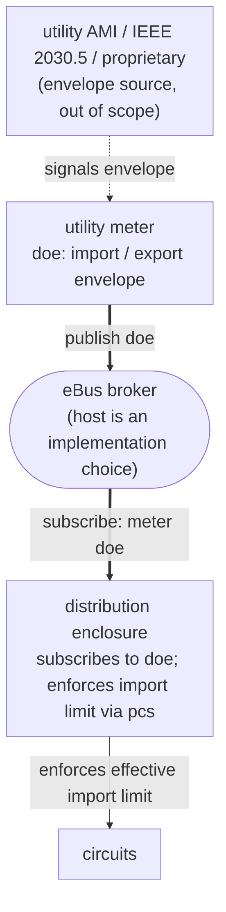

# Utility Meter ↔ Distribution Enclosure Integration Guide

**Type:** Integration Guide (informative)
**Status:** DRAFT
**Version:** 0.3
**Date:** 2026-07-27
**Authors:** Don Jackson

## Overview

This integration guide is **informative**. It describes how two [Electrification Bus](https://ebus.energy) (eBus for short) data models — the [utility meter](../data-models/utility-meter.md) and the [distribution enclosure](../data-models/distribution-enclosure.md) — compose at runtime when both are present on the same eBus broker, so that a utility-signaled operating envelope reaches the panel's UL 3141-listed Power Control System (PCS) and constrains the panel's load management. The normative property contracts remain in the individual data-model documents; this guide composes them.

The mechanism described here is vendor-neutral. A utility meter publishes its operating envelope to an eBus broker; a distribution enclosure subscribed to that envelope adopts it as the envelope it is acting on (its own `doe`), and its `pcs` reconciles that envelope, together with the enclosure's amps-native limits, into the enforced import limit. The data-model surfaces involved (`doe` on both devices, `pcs` on the distribution enclosure) make no vendor-specific assumptions; any conformant publisher / subscriber pair can participate.

## Audience and Scope

This guide is for:

- **Utility-meter publishers** (meter OEMs, AMI head-end adapters, integrator-built meter proxies) implementing `doe` on a utility-meter device.
- **Distribution-enclosure publishers** (panel vendors) implementing the subscriber side that consumes a meter's published envelope and reconciles it into the enclosure's `pcs` enforced import limit.
- **Integrators and commissioners** wiring a specific meter and panel together at install time.
- **Reviewers** wanting to understand how the two data-model surfaces compose.

The guide covers:

- The pub / sub flow.
- How the meter's `doe` envelope drives the enclosure's own `doe` and its `pcs` enforced import limit.
- The PCS import-limit composition when a meter-driven input is one of several active limits.
- Source attribution.
- Valid-until handling.
- Commissioning, discovery, and authorization at install time.
- Robustness and edge-case handling.

The guide does **not** cover:

- Normative property definitions — those live in [`data-models/utility-meter.md`](../data-models/utility-meter.md) and [`data-models/distribution-enclosure.md`](../data-models/distribution-enclosure.md).
- The mechanism by which a utility configures the meter's envelope (AMI head-end, IEEE 2030.5 / CSIP backhaul, proprietary protocols) — out of scope.
- Vendor-specific commissioning UIs and provisioning flows.

---

## Architecture

The integration uses three roles, two devices, and one broker.



Three roles:

- **Envelope publisher** — the utility meter. Publishes `doe/import-limit` (and optionally `doe/export-limit`) onto the eBus broker; each property is a JSON array of time-windowed envelope objects.
- **Envelope subscriber** — the distribution enclosure. Subscribes to the published envelope on the same broker and applies received values to its own internal state.
- **Enforcement publisher** — the same distribution enclosure. Independently of its subscriber role, the enclosure publishes its own `doe` (the envelope it is acting on) and its `pcs` result (the effective `import-limit` and the `binding-constraint`) so that downstream consumers (mobile app, dashboard, energy-management apps) can see what the PCS is currently enforcing.

Two devices, one broker. Both devices connect to the same eBus broker — the meter as a publisher of its `doe` properties, the enclosure as a subscriber to those properties (and, independently, as a publisher of its own `pcs` properties for downstream consumers). **Which LAN element hosts the broker is an implementation choice** that this guide deliberately does not constrain: it may be the enclosure, the meter, a separate gateway or hub, or any other device on the LAN. The pub / sub flow described in this guide is independent of that choice.

## Publish / subscribe semantics

### Topics

The utility meter publishes its full Homie 5 / eBus device representation onto the broker. The DOE properties land at:

```
ebus/5/<meter-id>/doe/import-limit
ebus/5/<meter-id>/doe/export-limit
```

The distribution enclosure subscribes to the meter's DOE node. The simplest robust subscription is to the wildcard `ebus/5/<meter-id>/doe/+` so the subscriber receives every DOE property as it is published, including future additions.

### No `/set` semantics

`doe` is publish-only. No `/set` topic is defined on any DOE property. The enclosure has no mechanism to tell the meter what envelope to publish — that is between the meter and the utility's out-of-band configuration channel.

This is a deliberate auth simplification. Each side requires only the minimum permission:

- The **meter** needs publish permission on its own device topics on the broker. It needs no read permission on the enclosure's topics and no write permission on any property of the enclosure.
- The **enclosure** needs subscribe permission on the meter's device topics on the broker. It needs no write permission on any property of the meter.

By contrast, an alternative design where the meter writes a value into one of the enclosure's `pcs` limits directly — either via MQTT `/set` or via a REST `PUT` — would require the enclosure to grant the meter write privilege on a property that directly controls the PCS. The publish / subscribe pattern avoids that entirely: the meter publishes its own state on its own topics; the enclosure subscribes and applies received values to its own state by its own internal logic. There is no shared mutable surface and no cross-device write privilege.

### Retained values

The DOE properties are published as retained MQTT messages (consistent with the Homie 5 convention for device properties). A subscriber that connects after a value has been published receives the most recent value immediately upon subscribing. The enclosure can re-establish subscription after a disconnect without missing the current envelope.

### Update cadence

DOE values change infrequently relative to instantaneous measurements — typically only when a utility-side event occurs (DR event, grid-management action, contract change). There is no required publish cadence; the meter publishes when the value changes, plus optional periodic re-publication for liveness. Subscribers should treat absence of an update as "no change" rather than as "still unknown."

---

## How the meter's `doe` drives the enclosure's `doe` and `pcs`

The enclosure consumes the meter's envelope and re-expresses it on two of its own surfaces. First, its own [`doe`](../data-models/distribution-enclosure.md#doe): the envelope it has obtained and is acting on, in **watts**, a read-only representation of its acting-on state (distinct from the meter's `doe`, which is the utility's signal at the service point). Second, its [`pcs`](../capabilities/pcs.md): the enclosure reconciles that watts envelope to a current limit and folds it into the `pcs` `min()`, publishing the effective `import-limit` (amps) and reporting `binding-constraint = DOE` when the envelope is the binding constraint. The envelope is never copied into an amps `pcs` slot; `pcs` publishes only the reconciled result.

When the enclosure receives a publish on the meter's `doe`, it updates its own surfaces:

| Source (on the meter) | Target (on the enclosure) | Notes |
|---|---|---|
| `doe/import-limit` (the envelope array) | enclosure's `doe/import-limit` | The enclosure republishes the full import schedule it is acting on, on its own `doe/import-limit` (watts): the same array of one or more envelopes (the current one plus any upcoming future-dated envelopes), so downstream scheduling consumers can pre-stage. |
| the effective envelope's `power-limit` (W) | reconciled into `pcs/import-limit` (A) | The enclosure converts watts to amps (`I = P / (V*pf)`) and enters that as a constraint in the `pcs` `min()`. When it is the most restrictive, `pcs/binding-constraint = DOE`. |
| the effective envelope's `apparent-power-limit` (VA) | (no `pcs` mapping yet) | `pcs` composes a real-power (amps) limit. If an envelope carries only apparent-power, the enclosure SHOULD derive an approximate real-power equivalent (a configured site power factor) for the reconciliation. |
| the effective envelope's `source` | (provenance via `binding-constraint`) | `pcs/binding-constraint = DOE` already tells consumers the grid envelope is the binding limit; the envelope's finer `source` stays readable on the `doe` topic. See "Source attribution" below. |
| `doe/export-limit` (the effective envelope) | enclosure's `doe/export-limit` | The enclosure republishes the export envelope it is acting on, on its own `doe/export-limit` (not a `pcs` slot: export enforcement is a DER-control concern). See "Export side" below. |

**Reconciled, not copied.** The enclosure adopts the envelope on its own `doe` (watts) and lets the `pcs` arbitrator reconcile it against the amps-native limits by `min()`, rather than copying the meter's watts value into a `pcs` limit. Clamping to the firm feed rating is exactly what that `min()` does (see "Import-limit composition"), so no slot needs to clamp.

### The enclosure is the authoritative publisher of its own `doe` and `pcs`

Even when the enclosure's acting-on envelope is driven by a meter subscription, the enclosure remains the authoritative publisher of its own `doe` (what it is acting on) and its `pcs` (what it is enforcing). Consumers reading the enclosure see its acting-on envelope and its effective import limit, which happen to derive from what the meter most recently signaled. The provenance is implicit and one-directional: the meter publishes its `doe` (the utility's signal), the enclosure publishes its `doe` (its acting-on state) and its `pcs` (its enforcement).

This is the same authoritative-publisher principle as proxy-published representations (see [`data-models/proxy.md`](../data-models/proxy.md)): one device owns each published surface, even when the underlying value originates elsewhere. This flow is not proxying (both devices natively publish their own data models), but the principle is the same.

## Import-limit composition

The enclosure's `pcs` reconciles every active import constraint to a current limit and enforces the most restrictive (`min()`), publishing the effective `import-limit` (amps) and the `binding-constraint` that names the winner. The constraints come from different regimes in their native units, each on its own capability (per [`pcs.md`](../capabilities/pcs.md)):

- amps-native `pcs` limits: `feed-import-limit` (the **Firm Service Rating**: the commissioned firm feed / service capacity, the always-on premises floor), `off-grid-import-limit` (when islanded), `requested-import-limit` (a voluntary, self-imposed homeowner / installer limit), and `operator-import-limit` (an externally imposed fleet / aggregator cap over a management API);
- the grid operating envelope on [`doe`](../capabilities/doe.md) (watts), reconciled to amps;
- the undervoltage current trim on [`voltage-response`](../capabilities/voltage-response.md) (volts).

The effective limit is:

```
import-limit = min(
    feed-import-limit,             (FSR, always on)
    reconcile(doe/import-limit),   (the meter-signaled envelope, W -> A)
    requested-import-limit,        (voluntary, when set)
    operator-import-limit,         (operator-imposed, when set)
    voltage-response trim,         (undervoltage, when active)
    [ off-grid-import-limit if islanded ]
)
```

and `binding-constraint` reports which class is binding (`FSR` / `DOE` / `REQUESTED` / `OPERATOR` / `VOLTAGE` / `OFF_GRID`). The main-breaker rating is a further ceiling the `min()` respects; it lives on the `breaker` capability (`breaker/rating`), not on `pcs`, and the FSR (`feed-import-limit`) may be lower than it when the upstream feed conductor is smaller than the main breaker.

**Why the envelope is reconciled, not clamped.** If the meter signals a 60 kW envelope on a panel whose FSR (`feed-import-limit`) is 200 A (about 48 kW at service voltage), the enclosure publishes the 60 kW envelope on its own `doe/import-limit` (mirroring what the utility signaled), reconciles it to about 250 A, and the always-on 200 A FSR wins the `min()`: the effective `import-limit` is 200 A and `binding-constraint = FSR`. Each layer reports its own value independently; the `min()` produces the right enforced limit without any layer having to clamp another.

### Requested vs operator limits (not the grid envelope)

Two amps-native `pcs` limits are easy to confuse with the utility grid envelope, and this guide's flow drives neither:

- `requested-import-limit` is a **voluntary, self-imposed** limit the homeowner or installer sets (for example via the vendor's mobile app), and is self-revocable.
- `operator-import-limit` is an **externally imposed** cap a fleet / aggregator / utility program sets over the vendor's management API, persisting until the operator changes it.

Both are distinct from the utility grid envelope, which the enclosure receives as `doe` through this guide's pub / sub flow and reconciles into the `pcs` `min()` (reported as `binding-constraint = DOE`), not into either slot. They all compose cleanly: if the homeowner has set `requested-import-limit = 33 A` while the meter signals a 30 kW (about 125 A) grid envelope, the effective limit is `min(33, 125, ...) = 33 A` with `binding-constraint = REQUESTED`, the tighter self-imposed request winning. Each path is independent, and each acts as a ceiling.

---

## Source attribution

Each `import-limit` envelope carries a `source` (`CONTRACT` / `REGULATOR` / `EQUIPMENT` / `GRID` / `UNKNOWN`). The enclosure's `pcs` already reports **which constraint class is binding** via `binding-constraint`, which reads `DOE` whenever the grid envelope is the effective limit. That is the provenance at the granularity `pcs` guarantees (which class won), and it needs no separate `pcs` source property.

The envelope's finer `source` (a temporary `GRID` action versus a permanent `CONTRACT` limit) stays readable on the `doe` topic, on both the meter's `doe` (the utility's signal) and the enclosure's `doe` (its acting-on state). A consumer that wants to tell a DR event from a contract limit reads it there; an enclosure MAY use it for local UI (a "demand response active" indicator) without adding it to a published `pcs` slot.

## Envelope window and schedule handling

Each `import-limit` envelope object carries an optional `start-time` and `end-time` (its validity window). Typical uses: a demand-response event with a defined window (a 4:00 PM to 7:00 PM peak event), a pre-scheduled grid-management action (a future `start-time`), a regulatory limit with a known sunset date.

The enclosure selects the effective element (the array element whose `[start-time, end-time)` window contains now, per [`doe.md`](../capabilities/doe.md)) and honours its window:

- **With an `end-time`**: when it elapses with no superseding envelope becoming effective, the envelope is no longer effective, so it drops out of the enclosure's acting-on `doe` and out of the `pcs` `min()`. The effective `import-limit` falls back to the next binding constraint (typically the FSR) and `binding-constraint` moves off `DOE`. Honouring the window is how the enclosure ends a DR event at the time the meter said it would, with no separate "end of event" publish.
- **With no `end-time`**: the limit has no defined end; the enclosure keeps acting on it until the meter publishes a new array. This is the steady-state case (contract limits, persistent envelopes).
- **With a future-dated element**: the enclosure applies it as its window becomes current. A subscriber that does not implement scheduling MUST behave conservatively: it MAY apply an upcoming stricter (lower) limit early, but MUST NOT apply an upcoming looser (higher) limit before its `start-time` (the safety asymmetry defined in `doe.md`).

A new publish from the meter supersedes the prior array in its entirety; the retained array is the complete current schedule. The enclosure's own `doe` carries that full schedule it is acting on, so a consumer that needs the current limit's expiry or its upcoming changes reads `doe/import-limit` (the meter's or the enclosure's) directly; `pcs` publishes only the reconciled result, not the schedule.

A separate, defensive-monitoring concern is a publisher going unreachable around expiry. A subscriber that wants extra robustness MAY independently track a "last seen at" and treat extended publisher silence as a fault, but that is layered on top of honouring the window, not a substitute for it.

## Export side

The utility-meter data model defines an export-side envelope (`doe/export-limit`), the same schema as the import side. The enclosure's `pcs` covers import limits only: the import-limit `min()` composition does not enforce an export limit. The export envelope instead has a home on the enclosure's own `doe`: an enclosure that obtains and acts on an export envelope republishes it on **its `doe/export-limit`** (see [`distribution-enclosure.md` §doe](../data-models/distribution-enclosure.md#doe)). It lives on `doe` rather than `pcs` because enforcing an export limit is a DER-control concern (curtailing PV / BESS), not an import-limit slot.

- A consumer reads the export envelope from the meter's `doe/export-limit` (the utility's signal) or the enclosure's `doe/export-limit` (what the enclosure is acting on), the same source-versus-acting-on distinction as the import side.
- Export *enforcement* (how the enclosure curtails DERs to stay under the export limit) is out of scope for this guide and belongs to a `der-control` capability.

---

## Commissioning

The enclosure needs three things to subscribe to the meter:

1. **A network path to the broker.** Both devices must reach the same eBus broker over the LAN. Network-provisioning specifics (Wi-Fi vs. Ethernet, addressing, mDNS discovery) are out of scope for this guide; vendors document them in their product-specific integration material.
2. **Broker credentials for each side.** Both the meter and the enclosure authenticate to whichever LAN element hosts the broker, using that host's provisioning flow, and obtain MQTT credentials. The host's auth interface is its own concern (typically a vendor-specific REST or out-of-band provisioning channel) and is outside the scope of this guide.
3. **Knowledge of which meter ID to subscribe to.** Two options:
   - **Discovery-driven** — the enclosure subscribes to Homie discovery topics, observes any device that advertises `$description.type = energy.ebus.device.utility-meter`, and subscribes to that device's `doe` automatically.
   - **Commissioning-driven** — the enclosure is configured at commissioning time with a specific utility-meter device ID and subscribes only to that meter.

Discovery-driven is simpler and matches the spirit of Homie's auto-discovery convention. Commissioning-driven is more deterministic and prevents the enclosure from accidentally subscribing to an unrelated meter that joins the same broker.

Both approaches are valid. Implementations SHOULD support discovery-driven subscription and MAY layer a commissioning-driven filter on top of it (e.g., subscribe to any utility-meter, but only apply published envelopes from a specifically commissioned device).

## Robustness and edge cases

| Scenario                                              | Subscriber (enclosure) behavior                                                          |
|---|---|
| Meter offline; broker stops receiving meter publishes | Keep acting on the last-retained envelope on the enclosure's own `doe`; the `pcs` keeps enforcing the reconciled `import-limit`. Retained MQTT messages remain the most recent published values. |
| Meter publishes an empty `import-limit` array, or omits it | Treat as no meter-signaled envelope: the enclosure's acting-on `doe/import-limit` goes absent, the `DOE` constraint drops out of the `pcs` `min()`, and `import-limit` falls back to the FSR (or the next binding limit). |
| Effective envelope's `power-limit` reconciles above the FSR | The `min()` caps the effective `import-limit` at the FSR (`binding-constraint = FSR`); the envelope is still published as-signaled on the enclosure's `doe`. No clamping at any slot. |
| The effective envelope's window (`end-time`) elapses with no superseding envelope | The envelope drops out of the acting-on `doe` and the `pcs` `min()`; `import-limit` falls back to the next binding limit (typically the FSR) and `binding-constraint` moves off `DOE`. Honouring the window is how the meter signals the end of a DR event without a separate "end of event" publish. See "Envelope window and schedule handling" above. |
| Subscription disconnects (the enclosure's MQTT client loses its connection to the broker) | Re-subscribe. Because messages are retained, re-subscription delivers the most recent published value immediately. |
| Enclosure restarts | On startup, the subscriber side re-subscribes and receives the retained DOE values. The PCS resumes enforcement based on the recovered envelope. |
| Meter publishes a value type the subscriber cannot parse | Treat as if no value were published; log diagnostic; revert to fallback. |
| Two utility-meter devices appear on the broker | An implementation choice. Discovery-driven subscribers SHOULD log a diagnostic and either (a) refuse to apply either value (safe default) or (b) apply the more-restrictive of the two values. Commissioning-driven subscribers ignore the non-commissioned device. The spec does not currently support multiple simultaneous utility meters on one service. |

## Examples

A concrete pub / sub trace showing a demand-response event.

```
T0: Steady state. Meter and enclosure online; a normal contract limit:

  ebus/5/meter-7a3f/doe/import-limit = [{"power-limit": 30000, "source": "CONTRACT"}]

     The enclosure has adopted it as its acting-on envelope and reconciled it:

  ebus/5/enclosure-c402/doe/import-limit       = [{"power-limit": 30000, "source": "CONTRACT"}]
  ebus/5/enclosure-c402/pcs/feed-import-limit  = 200   (A, the FSR, always on)
  ebus/5/enclosure-c402/pcs/import-limit       = 125   (A, effective = min; 30 kW reconciles to ~125 A)
  ebus/5/enclosure-c402/pcs/binding-constraint = DOE

T1: Utility issues a DR event via AMI. The meter publishes a tighter,
    windowed envelope:

  ebus/5/meter-7a3f/doe/import-limit = [{"power-limit": 12000, "source": "GRID", "end-time": "2026-06-05T19:00:00Z"}]

T2: The enclosure adopts it and re-reconciles:

  ebus/5/enclosure-c402/doe/import-limit       = [{"power-limit": 12000, "source": "GRID", "end-time": "..."}]
  ebus/5/enclosure-c402/pcs/import-limit       = 50    (A; 12 kW reconciles to ~50 A)
  ebus/5/enclosure-c402/pcs/binding-constraint = DOE

T3: The PCS curtails loads to the new limit. Deferrable loads (EVSE,
    water heater) are throttled; critical loads continue. A consumer
    reads binding-constraint = DOE and the enclosure's doe source = GRID
    and shows a "demand response active" indicator.

T4: The event's end-time elapses with no superseding envelope. The GRID
    envelope is no longer effective:

  ebus/5/enclosure-c402/doe/import-limit       = []    (until the meter republishes a post-event envelope)
  ebus/5/enclosure-c402/pcs/import-limit       = 200   (A; falls back to the FSR)
  ebus/5/enclosure-c402/pcs/binding-constraint = FSR

T5: The meter republishes the normal contract envelope; the enclosure
    re-adopts it, import-limit returns to 125 A and binding-constraint
    to DOE. Deferred loads resume.
```

Throughout the trace the meter never wrote to a PCS property and the enclosure never wrote to a DOE property. The two devices coordinated entirely through the pub / sub pattern with each side updating only its own published state.

## References

- [Utility-meter data model](../data-models/utility-meter.md) — defines `doe` (the publisher side).
- [Distribution-enclosure data model](../data-models/distribution-enclosure.md) — defines the enclosure's `doe` and `pcs` (the subscriber side's acting-on envelope and enforcement).
- [eBus capability-type registry](../registries/capability-types.md).
- [Proxy model](../data-models/proxy.md) — for the general convention that a device is the authoritative publisher of its own published surface even when the underlying value is sourced from another device.
- [UL 3141](https://www.shopulstandards.com/ProductDetail.aspx?productId=UL3141) — Power Control Systems. The standard the enclosure's PCS is listed against.
- IEEE 2030.5 / CSIP — origin of "dynamic operating envelope" terminology.
